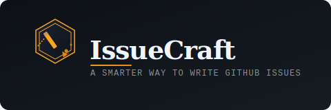

# IssueCraft

> A smarter way to write GitHub issues.



IssueCraft improves GitHub issues by rewriting rough reports into clear, structured reports for developers.
When someone opens an issue, it reads the content, improves the wording, points out missing details, and posts a polished comment back on the thread.

---

## Why use it?

- Helps maintainers triage faster
- Encourages better bug reports without extra templates
- Suggests useful labels from issue context
- Keeps feedback right inside the issue conversation

---

## Quick example

**Someone opens this issue:**

> Title: "Upload button not working"  
> Body: "Sometimes when I try uploading a PDF the upload does not start."

**IssueCraft posts:**

> ## AI Issue Enhancement
> **Detected Type:** Bug
>
> **Title**  
> Upload button intermittently fails for PDF uploads
>
> **Missing Information**  
> - Browser  
> - Operating system  
> - Exact steps to reproduce
>
> **Suggested Labels**  
> `bug` `upload`

See [`examples/`](./examples) for complete sample input/output.

---

## Requirements

- A GitHub repository with GitHub Actions enabled
- An OpenAI API key

---

## Setup

### 1. Add this workflow

Create `.github/workflows/issue-enhancer.yml` in your target repository:

```yaml
name: IssueCraft

on:
  issues:
    types: [opened]

jobs:
  enhance-issue:
    runs-on: ubuntu-latest
    permissions:
      issues: write

    steps:
      - uses: nameless-traveler/issuecraft@v1
        with:
          openai-api-key: ${{ secrets.OPENAI_API_KEY }}
```

`@v1` is the action version tag. Make sure the `v1` tag exists in your action repository.

### 2. Add your API key secret

In your repository, go to:

`Settings -> Secrets and variables -> Actions -> New repository secret`

Create:

- Name: `OPENAI_API_KEY`
- Value: your OpenAI API key

`github-token` is optional in workflow YAML because the action defaults it to `github.token`.

---

## Configuration

Settings are defined in [`src/utils/config.js`](./src/utils/config.js).

| Setting | Default | Description |
|---|---|---|
| `openai.model` | `gpt-4o` | Model used for analysis (can override with `OPENAI_MODEL`) |
| `openai.temperature` | `0.2` | Lower values produce more consistent output |
| `openai.maxTokens` | `1024` | Max tokens in model response |
| `openai.retryAttempts` | `3` | Retry attempts for failed API calls |
| `openai.retryDelayMs` | `1500` | Delay between retries in ms |
| `prompt.version` | `1.0.0` | Version shown in comment footer |

Use `LOG_LEVEL=debug` if you want verbose logs.

---

## Project structure

```text
issuecraft/
|-- .github/workflows/
|   `-- issue-enhancer.yml
|-- src/
|   |-- main/runEnhancer.js
|   |-- github/
|   |   |-- eventParser.js
|   |   `-- commentPoster.js
|   |-- ai/
|   |   |-- promptBuilder.js
|   |   |-- openaiClient.js
|   |   `-- responseParser.js
|   |-- formatter/
|   |   `-- markdownFormatter.js
|   `-- utils/
|       |-- config.js
|       `-- logger.js
|-- prompts/
|   `-- issue-enhancement.txt
|-- examples/
|   |-- messy_issue_example.md
|   `-- expected_output_example.md
|-- assets/
|   `-- issuecraft-logo.svg
|-- action.yml
`-- package.json
```

---

This README covers the initial V1 release. Future improvements will be added in later updates.

---

## License

[MIT](./LICENSE)
